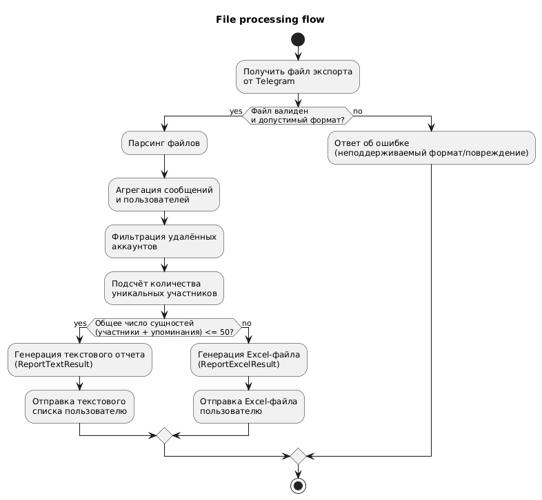
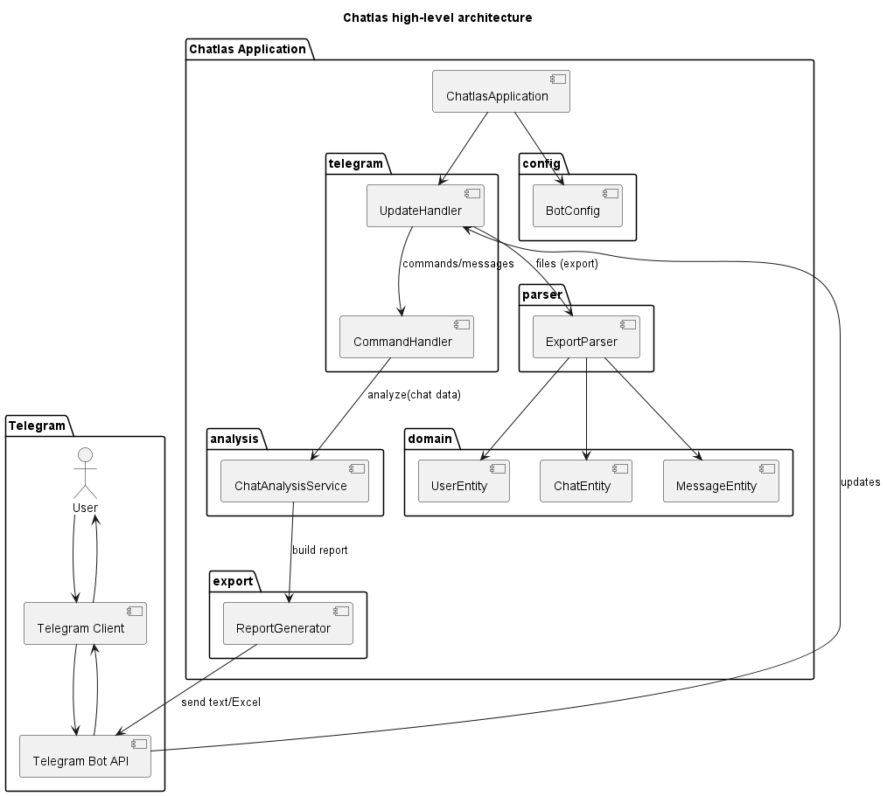
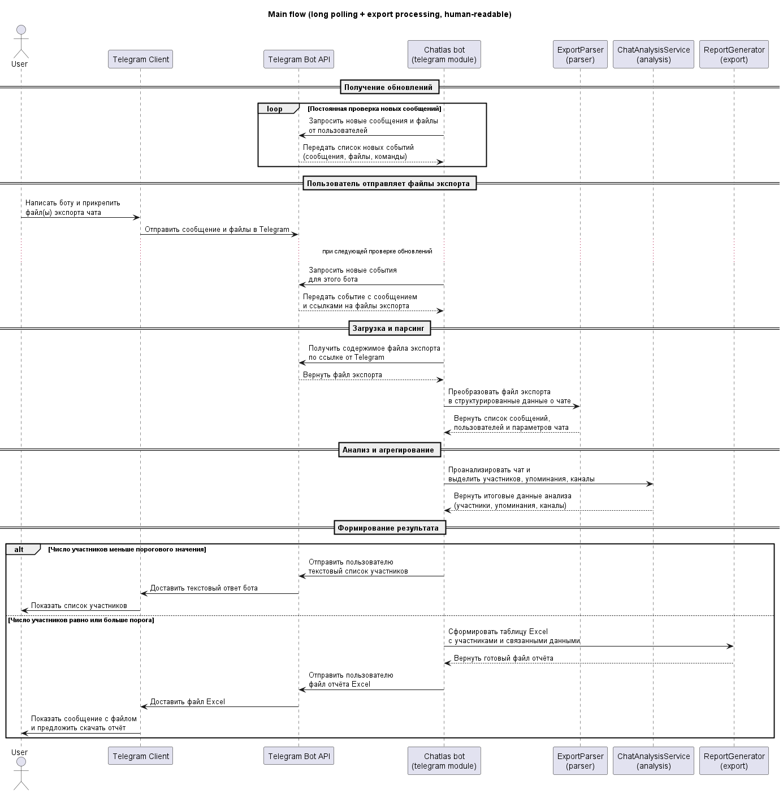
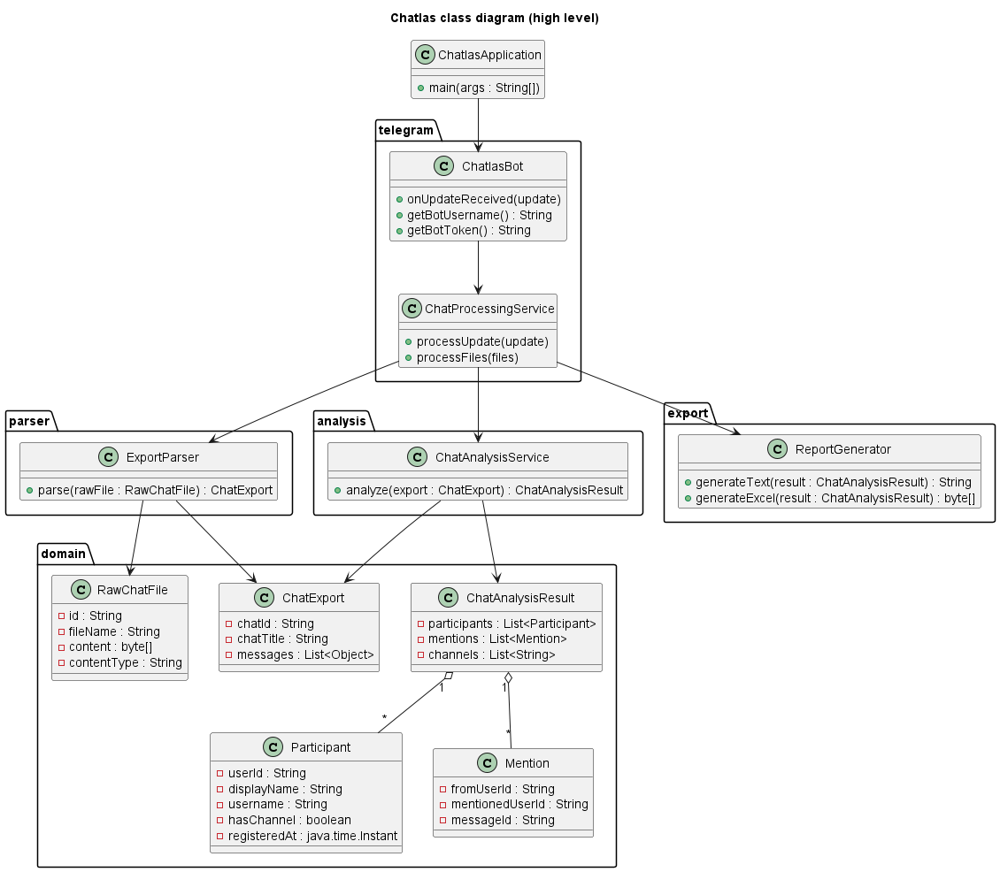
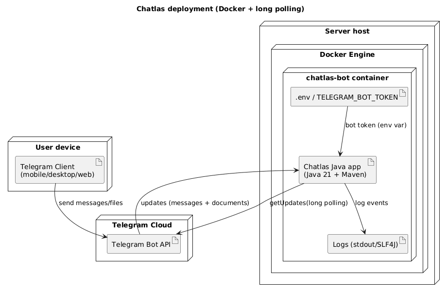

# Chatlas project description

Проект Chatlas представляет собой Telegram-бот, который принимает экспорт истории чата и формирует список участников.

## Структура проекта

- `ChatlasApplication.java` – точка входа приложения (инициализация бота и инфраструктуры).

- `analysis/` – логика анализа/агрегации данных экспорта: извлечение участников, подсчёт, фильтрация и бизнес‑правила.

- `parser/` – парсер файлов экспорта Telegram.

- `domain/` – доменная модель: сущности пользователей, сообщений, чатов, упоминаний, отчётов и т.п.

- `export/` – генерация выходных артефактов (текстовые списки и Excel-отчеты).

- `telegram/` – интеграция с TelegramBots: обработчики апдейтов, команд, получение и пересылка файлов/документов.

- `config/` – конфигурация приложения.

- `src/test/java/ru/hackathon/chatlas` – модульные/интеграционные тесты для парсера, анализа и прочих компонентов.

- `src/test/resources` – тестовые данные.

## Общее описание процесса
Общий алгоритм работы бота можно описать в виде flowchart‑диаграммы, отражающей пошаговую обработку входящих файлов экспорта чатов.

Пошаговое описание:
1. Получение от пользователя сообщений и вложений: Telegram-клиент отправляет файлы экспорта в чат с ботом.
2. Бот получает ссылки на эти файлы от Bot API.
3. Проверки: валидность формата и соответствие поддерживаемым типам экспорта (только JSON-файлы).
4. После валидации реализуется парсинг файлов.
5. На следующих шагах происходит агрегация данных: строится множество уникальных участников, находятся и связываются упоминания, отбрасываются удалённые аккаунты и формируется итоговая структура результата.
6. Выполняется генерация результата: в зависимости от общего количества уникальных сущностей (участники + упоминания) создается либо текстовый список, либо Excel‑файл. Если общее число сущностей меньше или равно 50, генерируется текстовый список и отправляется пользователю как обычное сообщение, если больше или равно 51 — генерируется Excel‑файл и отправляется как документ. Все данные обрабатываются в памяти и не сохраняются на диск.

## Архитектура решения

В основе проекта лежит многослойная архитектура, разделяющая интеграцию с Telegram, доменную логику (парсинг и анализ) и слой представления результатов (генерация текстов и Excel‑отчётов).

Telegram‑бот, реализованный через библиотеку TelegramBots и режим long polling, получает обновления от Telegram API и передаёт их в сервис обработки, который последовательно вызывает парсер экспорта, сервис анализа чатов и генератор отчётов.

Доменная модель описывает сущности чата, участников, упоминаний и итогового аналитического результата, что позволяет изолировать бизнес‑логику от деталей транспорта и хранилища.

## Описание последовательности взаимодействия
Последовательность взаимодействия между пользователем и компонентами Telegram-бота отображена на диаграмме последовательности.

Диаграмма последовательности показывает взаимодействие между пользователем, Telegram, ботом и внутренними сервисами при типичном сценарии. Пользователь отправляет команду и файлы экспорта через клиент Telegram; эти данные попадают в Telegram Bot API, а затем бот забирает их при очередном вызове метода получения обновлений. Получив обновление, бот извлекает идентификаторы файлов и запрашивает их содержимое через Telegram API, после чего передаёт полученные данные в сервис обработки (ChatProcessingService).

Сервис обработки последовательно вызывает парсер (который возвращает структурированный экспорт), затем сервис анализа (формирующий объект результата анализа — список участников, упоминаний и т.д.), и наконец генератор отчётов (который создаёт либо текстовый список, либо Excel‑файл в зависимости от общего количества сущностей — участники + упоминания). Бот отправляет результат обратно через Bot API, после чего пользователь получает сообщение или документ в своём Telegram‑клиенте. Такая последовательность подчёркивает чёткое разделение ролей: Telegram обеспечивает транспорт, бот‑обёртка отвечает за протокол и оркестрацию, а специализированные сервисы – за бизнес‑логику анализа и представления данных.

## Доменная модель и ключевые классы

Доменная модель проекта описывает основные сущности, с которыми работает бот, и отражается на диаграмме классов. В неё входят, в частности, объекты для представления сырых файлов экспорта (их имени и содержимого), структурированного экспорта чата (идентификатор, название, список сообщений), участников (идентификатор пользователя в рамках выгрузки, отображаемое имя) и упоминаний (текст упоминания @username). Итог анализа инкапсулируется в результирующем объекте, который содержит списки участников и упоминаний, необходимых для построения отчёта.

Отдельный класс Telegram‑бота реализует интерфейсы TelegramBots и отвечает за приём обновлений и идентификацию бота (имя и токен).

Сервис обработки обновлений (chat‑processing) выступает оркестратором над тремя основными сервисами: парсером экспорта, сервисом анализа чатов и генератором отчётов; он получает доменные объекты от парсера, передаёт их в анализ, затем генератор отчётов создаёт либо текстовый список, либо Excel‑файл в зависимости от общего количества сущностей (участники + упоминания), и отправляет результат пользователю.

## Развёртывание

На диаграмме развёртывания отображены три основные стороны: клиентское устройство с приложением Telegram, облачная инфраструктура Telegram Bot API и сервер, на котором работает контейнер chatlas-bot.

Проект развёртывается как Java‑приложение (Java 21 + Maven), упакованное в Docker‑контейнер, что облегчает запуск в разных средах (локальная разработка, учебный сервер, облачный хостинг).

Контейнер получает токен бота через переменные окружения или .env‑файл, использует стандартный вывод/логирование SLF4J для регистрации событий и устанавливает исходящие соединения к Telegram API по протоколу HTTPS для получения обновлений и отправки ответов.

Коммуникация организована по схеме long polling: контейнер периодически обращается к Bot API методом получения обновлений, поэтому входящие соединения снаружи не требуются и не настраивается вебхук. Это упрощает эксплуатацию: для запуска достаточно работающего Docker‑демона и корректно установленного токена, без дополнительной прокси‑ или nginx‑конфигурации.

